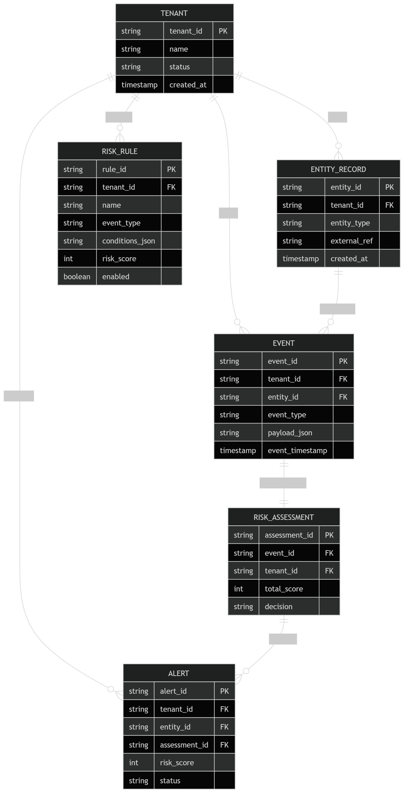

# Risk Detection Platform (Spring Boot)

A multi-tenant **risk detection and alerting platform** built with Spring Boot.

The system ingests events, evaluates them against configurable rules, calculates a risk score, and generates alerts when thresholds are exceeded.

---

# Overview

This project simulates a real-world **fraud detection / risk engine** used in:

- Fintech platforms
- Banking systems
- Anti-abuse systems
- Identity verification pipelines

---

# ️ Core Features

- Multi-tenant architecture (tenant isolation)
- Event ingestion API
- Rule-based risk scoring engine
- JSON-based rule conditions
- Risk assessment generation
- Alert creation based on thresholds
- REST API with validation
- Global exception handling
- Unit tests (services)
- Controller tests (MockMvc)

---

# Architecture

## Architecture Overview

The platform currently follows a layered modular monolith architecture using Spring Boot.

### High-Level Flow

```text
Client Request
    ↓
Controller Layer
    ↓
Service Layer
    ↓
Repository Layer
    ↓
PostgreSQL
```

### Core Architectural Components

#### Controller Layer
Responsible for exposing REST APIs and handling HTTP requests/responses.

Examples:
- TenantController
- EventController
- RiskRuleController
- AlertController

Responsibilities:
- Request validation
- Request mapping
- Response formatting
- Delegating business logic to services

---

#### Service Layer
Contains the core business logic of the platform.

Examples:
- EventService
- RiskRuleService
- RiskEngineService
- AlertService
- RiskAssessmentService

Responsibilities:
- Event ingestion
- Rule evaluation
- Risk scoring
- Alert generation
- Tenant validation
- Assessment creation

The service layer acts as the orchestration layer of the platform.

---

#### Repository Layer
Handles persistence and database access using Spring Data JPA.

Examples:
- EventRepository
- RiskRuleRepository
- AlertRepository

Responsibilities:
- CRUD operations
- Filtering
- Pagination
- Tenant-specific data retrieval

---

#### Database Layer
The platform uses PostgreSQL as the primary relational database.

Database schema management is handled through Flyway migrations.

Key entities include:
- Tenants
- Events
- Risk Rules
- Risk Assessments
- Rule Hits
- Alerts
- Entity Records

---

### Rule Engine Architecture

Incoming events are evaluated against configurable risk rules stored in the database.

Flow:

```text
Event Ingestion
    ↓
Load Enabled Rules
    ↓
Evaluate Rule Conditions
    ↓
Calculate Total Risk Score
    ↓
Create Risk Assessment
    ↓
Generate Alert (if threshold exceeded)
```

Supported rule operators:
- EQUALS
- NOT_EQUALS
- GREATER_THAN
- LESS_THAN
- GREATER_THAN_OR_EQUALS
- LESS_THAN_OR_EQUALS
- AND
- OR

---

### Exception Handling

The platform uses centralized global exception handling through:

```java
@RestControllerAdvice
```

This avoids excessive try/catch blocks throughout controllers and services while ensuring standardized API error responses.

---

### Mapping Strategy

The platform uses MapStruct for DTO ↔ Entity mapping.

Benefits:
- Cleaner services/controllers
- Reduced boilerplate
- Better separation of concerns

---

### Current Architectural Direction

The project intentionally starts as a modular monolith to:
- simplify development
- reduce operational complexity
- iterate quickly on business logic

The architecture is being designed to later evolve into microservices when scaling requirements justify the added complexity.

Potential future service extraction areas:
- Event ingestion service
- Rule evaluation service
- Alerting service
- Graph analysis service
- Feature store service

---

# Tech Stack

- Java 17+
- Spring Boot 3
- Spring Web
- Spring Data JPA
- PostgreSQL
- Flyway (DB migrations)
- MapStruct (DTO mapping)
- Lombok
- JUnit 5 + Mockito
- MockMvc (controller testing)
- Docker (PostgreSQL)

---

# Getting Started

## 1. Clone the repository

```bash
git clone https://github.com/YOUR_USERNAME/risk-platform.git
cd risk-platform
```

## Docker Setup

The platform supports containerized local development using Docker and Docker Compose.

## Project Docker Files

The following files are included in the project root:

```text
Dockerfile
docker-compose.yml
.dockerignore
```

---

## Environment Configuration

Create a `.env` file in the project root:

```env
DB_HOST=localhost
DB_PORT=5432
DB_NAME=risk_platform
DB_USER=risk_user
DB_PASSWORD=risk_pass
```

---

## Build and Run

From the project root:

```bash
docker compose up --build
```

This will:
1. Build the Spring Boot application image
2. Start the PostgreSQL container
3. Run Flyway migrations automatically
4. Start the API on port 8080

---

## Accessing the Application

API:
```text
http://localhost:8080
```

Swagger/OpenAPI:
```text
http://localhost:8080/swagger-ui/index.html
```

---

## Stopping Containers

```bash
docker compose down
```

---

## Rebuilding After Changes

```bash
docker compose up --build
```

---

## Database Persistence

PostgreSQL data is persisted using Docker volumes.

This ensures:
- container restarts do not lose data
- local development data remains available

---

## Docker Networking Notes

Inside Docker Compose:
- the Spring Boot application connects to PostgreSQL using the container service name
- `DB_HOST=postgres`

Example internal connection:

```text
jdbc:postgresql://postgres:5432/risk_platform
```

Outside Docker (local IntelliJ runs):
- `DB_HOST=localhost`

---

## Flyway Migrations

Flyway migrations automatically execute on application startup.

Migration files are located in:

```text
src/main/resources/db/migration
```

Example:

```text
V1__init_schema.sql
```

---
## When not using Docker
### 4. Configure IntelliJ environment variables
```
DB_HOST=localhost;DB_PORT=5432;DB_NAME=risk_platform;DB_USER=risk_user;DB_PASSWORD=risk_pass
```

### 5. Run the Application
```
./mvnw spring-boot:run
```

### 6. Open Swagger UI
```
http://localhost:8080/swagger-ui/index.html
```

---
# API Endpoints

## Tenant
```
POST /api/v1/tenants
```

## Entity
```text
POST /api/v1/entities
GET  /api/v1/entities
```

## Rules
```text
POST /api/v1/rules
GET  /api/v1/rules?eventType=LOGIN
```

## Events 
```text
POST /api/v1/events
GET  /api/v1/events/{eventId}
```

## Alerts
```text
GET   /api/v1/alerts?status=OPEN
PATCH /api/v1/alerts/{alertId}/status
```

---
# Risk Scoring Logic

Each rule contains:
```json
{
  "field": "knownDevice",
  "value": false
}
```
Evaluation:
```text
if (payload[field] == value) → add rule.riskScore
```

---
## Decision Thresholds
| Score | Decision |
|-------|----------|
| < 50 | ALLOW   |
| 50–79 | REVIEW   |
| ≥ 80 | BLOCK   |

---
# Database Design

## Entities
- Tenant
- EntityRecord
- Event
- RiskRule
- RiskAssessment
- Alert

## ERD


---
# Testing
Run Tests:
```bash
./mvnw test
```
Includes:
- Unit tests (service layer)
- Controller tests (MockMvc)

---
# Configuration and Security

- .env is ignored from Git
- No credentials stored in the code
- Tenant isolation enforced in service layer
- Global exception handling implemented

---
# Roadmap

## Phase 1 (Completed)
- [x] REST API structure
- [x] Multi-tenancy support
- [x] Event ingestion
- [x] Rule engine (basic)
- [x] Risk scoring
- [x] Alert generation
- [x] Unit + controller tests

## Phase 2 (Next)
- [x] Rule operators (>, <, AND, OR)
- [x] Rule hit tracking
- [x] Pagination + filtering
- [ ] Improved validation and error handling

## Phase 3
- [ ] Feature store (user behavior history)
- [ ] Velocity rules (e.g. login frequency)
- [ ] Device/IP fingerprinting
- [ ] Risk aggregation over time
- [ ] Behavioral anomaly detection

## Phase 4
- [ ] Graph-based analysis (Neo4j)
- [ ] Shared device/IP detection
- [ ] Fraud ring detection
- [ ] Entity relationship scoring

## Phase 5
- [ ] Async processing (Kafka/RabbitMQ)
- [ ] Microservices architecture
- [ ] Real-time dashboards
- [ ] ML-based scoring

## Future Improvements
- [ ] Authentication (JWT / OAuth2)
- [ ] Role-based access control
- [ ] Audit logging
- [ ] Rate limiting
- [ ] Observability (Prometheus, Grafana)
---

# Notes

This project is purely for the intention of upskilling and learning. Any feedback would be appreciated.
