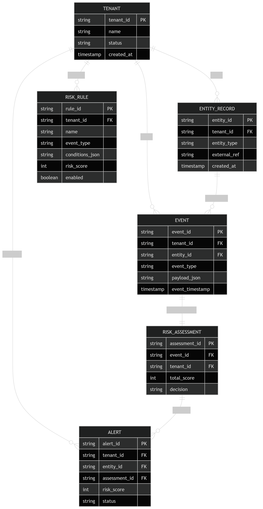

# Fraud and Risk Management Platform (Spring Boot)

A multi-tenant **fraud detection and risk management platform** being built with Spring Boot.

The current system ingests events, evaluates them against configurable rules, calculates a risk score, and generates alerts when thresholds are exceeded. The product direction is to let tenants configure risk policies, evaluate risky transactions and account activity, investigate suspected fraud, and record outcomes.

---

# Overview

This project is a learning prototype evolving toward tenant-managed fraud and risk workflows for:

- Fintech platforms
- Banking systems
- Anti-abuse systems
- Identity verification pipelines

The first product milestone is one complete **tenant-managed transaction review flow**: ingest a transaction, calculate behavior features, return an explained decision, let an analyst investigate, and record the resolution. Login abuse detection remains a related use case for the same event and rule engine.

Commercial usefulness still needs validation with a specific customer segment and pilot. The immediate focus is straightforward integration, understandable decisions, and useful analyst workflows.

## Current State and Planned Capabilities

| Area | Implemented today | Planned |
|------|-------------------|---------|
| Tenant management | Tenant records and tenant-scoped operations in several services | Authentication, tenant-bound authorization on every operation, administrator/analyst/read-only roles |
| Detection | Rules over incoming payload fields, scores, assessments, and rule hits | Server-calculated history, velocity rules, tenant-configurable decision thresholds |
| Behavior history | Persisted per-tenant/entity total events, last seen time, last IP, and last device; updated during ingestion | Use history in evaluation, reliable concurrent updates, time-window features |
| Transactions | Generic events can carry transaction data | Validated transaction contract, currency-aware amounts, external transaction IDs, timestamps, and idempotent ingestion |
| Decisions | Synchronous evaluation; ingestion returns event/assessment IDs and `ACCEPTED` | Return score, decision, and reasons directly; support monitoring-only rollout |
| Fraud operations | Alerts and alert status updates | Tenant console, assigned cases, investigation notes, fraud/legitimate outcomes, and audit history |

The application is not yet ready for a customer pilot. Tenant isolation is incomplete in some read paths, authentication is absent, profile increments can lose updates under concurrency, and some rule evaluation failures silently become non-matches. These are explicit roadmap items below.

---

# ️ Core Features

- Multi-tenant data model and tenant-scoped service operations (authorization hardening planned)
- Event ingestion API
- Rule-based risk scoring engine
- JSON-based rule conditions
- Risk assessment generation
- Alert creation based on thresholds
- REST API with validation
- Global exception handling
- Unit tests (services)
- Controller tests (MockMvc)
- Basic entity behavior profile persistence
- Integration tests for event flows and validation

---

# Architecture

## Architecture Overview

The platform currently follows a layered modular monolith architecture using Spring Boot.

### High-Level Flow

```text
Client Request
    ↓
Controller Layer
    ↓
Service Layer
    ↓
Repository Layer
    ↓
PostgreSQL
```

### Core Architectural Components

#### Controller Layer
Responsible for exposing REST APIs and handling HTTP requests/responses.

Examples:
- TenantController
- EventController
- RiskRuleController
- AlertController

Responsibilities:
- Request validation
- Request mapping
- Response formatting
- Delegating business logic to services

---

#### Service Layer
Contains the core business logic of the platform.

Examples:
- EventService
- RiskRuleService
- RiskEngineService
- AlertService
- RiskAssessmentService

Responsibilities:
- Event ingestion
- Rule evaluation
- Risk scoring
- Alert generation
- Tenant validation
- Assessment creation

The service layer acts as the orchestration layer of the platform.

---

#### Repository Layer
Handles persistence and database access using Spring Data JPA.

Examples:
- EventRepository
- RiskRuleRepository
- AlertRepository

Responsibilities:
- CRUD operations
- Filtering
- Pagination
- Tenant-specific data retrieval

---

#### Database Layer
The platform uses PostgreSQL as the primary relational database.

Database schema management is handled through Flyway migrations.

Key entities include:
- Tenants
- Events
- Risk Rules
- Risk Assessments
- Rule Hits
- Alerts
- Entity Records
- Entity Behavior Profiles

---

### Rule Engine Architecture

Incoming events are evaluated against configurable risk rules stored in the database.

Flow:

```text
Event Ingestion
    ↓
Persist Event and Update Basic Behavior Profile
    ↓
Load Enabled Rules
    ↓
Evaluate Rule Conditions
    ↓
Calculate Total Risk Score
    ↓
Create Risk Assessment
    ↓
Generate Alert (if threshold exceeded)
```

Supported rule operators:
- EQUALS
- NOT_EQUALS
- GREATER_THAN
- LESS_THAN
- GREATER_THAN_OR_EQUALS
- LESS_THAN_OR_EQUALS
- AND
- OR

Evaluation currently reads only the event payload. Stored behavior profiles do not yet influence scores. `FeatureProfile` and `EnrichedEvent` provide model scaffolding for future capabilities; their presence does not mean feature calculation or fingerprinting is implemented.

### Planned Transaction and Fraud Workflow

```text
Authenticated Tenant Integration
    ↓
Validate Transaction and Deduplicate Retries
    ↓
Load Prior Behavior and Calculate Time-Window Features
    ↓
Evaluate Tenant Rules and Decision Thresholds
    ↓
Return Decision, Score, and Reasons; Persist Assessment
    ↓
Tenant Integration Applies Hold / Block / Allow
    ↓
Analyst Investigates Case and Records Outcome
```

For example, a tenant could choose to review a transaction above a configured amount when the customer has made more than five transactions in ten minutes. The platform would calculate the count itself, explain the rule match, and create a review item. This is a planned example, not a currently supported history-based rule.

An `ALLOW`, `REVIEW`, or `BLOCK` decision is a recommendation from the engine. The tenant's application or payment integration must enforce the corresponding action; the platform does not currently stop or hold payments.

Feature calculation must define whether the current event counts toward a window and preserve prior device/IP values before updating the profile. Server-derived features must remain separate from customer-supplied payload fields.

---

### Exception Handling

The platform uses centralized global exception handling through:

```java
@RestControllerAdvice
```

This avoids excessive try/catch blocks throughout controllers and services while ensuring standardized API error responses.

---

### Mapping Strategy

The platform uses MapStruct for DTO ↔ Entity mapping.

Benefits:
- Cleaner services/controllers
- Reduced boilerplate
- Better separation of concerns

---

### Current Architectural Direction

The project intentionally starts as a modular monolith to:
- simplify development
- reduce operational complexity
- iterate quickly on business logic

The planned fraud workflows can be implemented within this modular monolith. Service extraction and asynchronous processing will be considered when measured scaling or operational requirements justify them.

Potential future service extraction areas:
- Event ingestion service
- Rule evaluation service
- Alerting service
- Graph analysis service
- Feature store service

---

# Tech Stack

- Java 21
- Spring Boot 3
- Spring Web
- Spring Data JPA
- PostgreSQL
- Flyway (DB migrations)
- MapStruct (DTO mapping)
- Lombok
- JUnit 5 + Mockito
- MockMvc (controller testing)
- Docker (PostgreSQL)

---

# Getting Started

## 1. Clone the repository

```bash
git clone https://github.com/YOUR_USERNAME/risk-platform.git
cd risk-platform
```

## Docker Setup

The platform supports containerized local development using Docker and Docker Compose.

## Project Docker Files

The following files are included in the project root:

```text
Dockerfile
docker-compose.yml
.dockerignore
```

---

## Environment Configuration

Create a `.env` file in the project root:

```env
DB_HOST=localhost
DB_PORT=5432
DB_NAME=risk_platform
DB_USER=risk_user
DB_PASSWORD=risk_pass
```

---

## Build and Run

From the project root:

```bash
docker compose up --build
```

This will:
1. Build the Spring Boot application image
2. Start the PostgreSQL container
3. Run Flyway migrations automatically
4. Start the API on port 8080

---

## Accessing the Application

API:
```text
http://localhost:8080
```

Swagger/OpenAPI:
```text
http://localhost:8080/swagger-ui/index.html
```

---

## Stopping Containers

```bash
docker compose down
```

---

## Rebuilding After Changes

```bash
docker compose up --build
```

---

## Database Persistence

PostgreSQL data is persisted using Docker volumes.

This ensures:
- container restarts do not lose data
- local development data remains available

---

## Docker Networking Notes

Inside Docker Compose:
- the Spring Boot application connects to PostgreSQL using the container service name
- `DB_HOST=postgres`

Example internal connection:

```text
jdbc:postgresql://postgres:5432/risk_platform
```

Outside Docker (local IntelliJ runs):
- `DB_HOST=localhost`

---

## Flyway Migrations

Flyway migrations automatically execute on application startup.

Migration files are located in:

```text
src/main/resources/db/migration
```

Example:

```text
V1__init_schema.sql
```

---
## When not using Docker
### 4. Configure IntelliJ environment variables
```
DB_HOST=localhost;DB_PORT=5432;DB_NAME=risk_platform;DB_USER=risk_user;DB_PASSWORD=risk_pass
```

### 5. Run the Application
```
./mvnw spring-boot:run
```

### 6. Open Swagger UI
```
http://localhost:8080/swagger-ui/index.html
```

---
# API Endpoints

## Tenant
```
POST /api/v1/tenants
```

## Entity
```text
POST /api/v1/entities
GET  /api/v1/entities
```

## Rules
```text
POST /api/v1/rules
GET  /api/v1/rules?eventType=LOGIN
```

## Events 
```text
POST /api/v1/events
GET  /api/v1/events/{eventId}
```

## Alerts
```text
GET   /api/v1/alerts?status=OPEN
PATCH /api/v1/alerts/{alertId}/status
```

---
# Risk Scoring Logic

Example condition group stored in a rule's `conditionsJson`:
```json
{
  "operator": "AND",
  "conditions": [
    {
      "field": "knownDevice",
      "operator": "EQUALS",
      "value": false
    }
  ]
}
```
Evaluation:
```text
if (payload[field] == value) → add rule.riskScore
```

In this example, `knownDevice` must currently be supplied in the payload; the engine does not calculate it from device history. Scores sum the scores of matched rules, and rule hits retain the matched contributions.

---
## Decision Thresholds
| Score | Decision |
|-------|----------|
| < 50 | ALLOW   |
| 50–79 | REVIEW   |
| ≥ 80 | BLOCK   |

These thresholds are currently fixed in code. Scores of 50 or above also create an alert. Tenant-configurable thresholds and explained decisions in the ingestion response are planned.

---
# Database Design

## Entities
- Tenant
- EntityRecord
- Event
- RiskRule
- RiskAssessment
- RuleHit
- Alert
- EntityBehaviorProfile

## ERD


---
# Testing
Run Tests:
```bash
./mvnw test
```
Includes:
- Unit tests (service layer)
- Controller tests (MockMvc)
- Integration tests for event processing, behavior profile persistence, and validation

---
# GitHub Automation

The repository includes `.github/workflows/ci.yml` and `.github/dependabot.yml`.

| Check | When | Purpose |
|-------|------|---------|
| Build and test | Pull requests, pushes to `main`, or manual dispatch | Java 21 Maven verification with a disposable PostgreSQL 16 service; runs unit, controller, and integration tests and exercises Flyway migrations |
| Docker build | Same CI triggers | Builds the existing Dockerfile to catch packaging failures; does not publish or deploy an image |
| Dependabot security updates | When an enabled Dependabot alert has an available automated fix | Proposes updates for known vulnerable dependencies; routine version-update PRs are disabled and fixes are not automatically merged |

CI overrides Spring datasource settings with disposable database credentials, so no database secrets or access to a developer database are needed. Test reports are uploaded even after test failures and retained for seven days. The workflow explicitly includes the existing tenant service test class named `TenantService.java`, which Maven's default test naming patterns would otherwise miss.

To activate, commit and push the configuration to GitHub with Actions enabled for the repository. After the first successful run, configure a branch ruleset for `main` requiring **Build and test** and **Docker build** before merging. These repository settings must be enabled separately. Both jobs must pass: the Dockerfile itself skips tests.

Dependency maintenance follows a security-first policy: detect known vulnerabilities, review the proposed remediation, and run CI before merging. All ecosystems have `open-pull-requests-limit: 0`, which disables routine version-update PRs while allowing enabled security updates. The weekly schedule remains only because the configuration schema requires it; security updates are driven by alerts. Version exclusions have been removed so they do not obstruct required fixes.

An administrator must enable **Dependency graph**, **Dependabot alerts**, and **Dependabot security updates** under the repository's security settings. The YAML file alone does not activate vulnerability detection or security fixes. Enable automatic dependency submission for Maven if available to improve coverage of resolved dependencies. Review any existing routine update PRs separately.

A security fix can still require a coordinated framework upgrade and can fail CI. Some alerts cannot be fixed automatically and require manual remediation. For example, Spring Boot 3.3.x pairs with springdoc 2.6.x; use the [springdoc compatibility matrix](https://springdoc.org/#faq) when evaluating an upgrade. Plan occasional maintenance for unsupported dependencies even when no vulnerability alert is present.

Dependabot is not a container-image vulnerability scanner. The Docker job currently checks only that the image builds; scanning operating-system packages inside the image would require a separate scanner such as Trivy or Grype.

Suggested follow-ups:

- CodeQL scanning for Java once code scanning availability is confirmed for the repository.
- JaCoCo coverage reporting, followed by a meaningful coverage baseline for detection and tenant authorization logic.
- Tagged image publishing and deployment when a registry and hosting target have been chosen.

References: [GitHub Maven CI](https://docs.github.com/en/actions/tutorials/build-and-test-code/java-with-maven), [PostgreSQL services](https://docs.github.com/en/actions/tutorials/use-containerized-services/create-postgresql-service-containers), and [Dependabot configuration](https://docs.github.com/en/code-security/reference/supply-chain-security/dependabot-options-reference).

---
# Configuration and Security

- .env is ignored from Git
- Use local development credentials only for local development
- Tenant checks exist in service operations, but some ID-based reads still require tenant scoping
- Authentication, role-based access, and audit history are planned before a tenant pilot
- Global exception handling implemented

---
# Roadmap

## Phase 1 (Completed)
- [x] REST API structure
- [x] Multi-tenancy support
- [x] Event ingestion
- [x] Rule engine (basic)
- [x] Risk scoring
- [x] Alert generation
- [x] Unit + controller tests

## Phase 2 (Completed)
- [x] Rule operators (>, <, AND, OR)
- [x] Rule hit tracking
- [x] Pagination + filtering
- [x] Improved validation and error handling

Phases 1 and 2 describe the existing prototype foundation, not production readiness. Phase 3 has started with basic history persistence. Security and tenant administration now precede a customer-facing fraud workflow.

## Phase 3 — Secure Tenant Management and Reliable History (Current)
- [x] Persist basic entity behavior profiles and update them during ingestion
- [x] Unit and integration coverage for basic profile persistence
- [ ] Authentication for tenant users and API integrations (JWT / OAuth2)
- [ ] Derive tenant access from authenticated identity and scope every read/write to that tenant
- [ ] Tenant roles: administrator, analyst, and read-only user
- [ ] Audit history for rule, configuration, and analyst decision changes
- [ ] Make profile creation and counter updates safe under concurrent ingestion
- [ ] Surface invalid rules and evaluation errors explicitly instead of silently treating them as non-matches
- [ ] Add authorization and concurrent ingestion regression coverage

## Phase 4 — Transaction Decisions and Velocity Rules
- [ ] Define a validated transaction event contract: external transaction ID, amount, currency, customer/entity, recipient, and event timestamp
- [ ] Idempotent transaction ingestion so retries do not duplicate assessments, alerts, or history
- [ ] Define timestamp handling and time-window semantics, including late events and whether the current event is counted
- [ ] Add indexed tenant/entity/event-type/time-window queries
- [ ] Build an evaluation context combining payload data with separate server-calculated behavior features
- [ ] Velocity rules for login frequency, transaction frequency, and cumulative spend with explicit currency handling
- [ ] Tenant-managed rule lifecycle and configurable score thresholds
- [ ] Return decision, score, and matched reasons directly from synchronous evaluation
- [ ] Monitoring-only mode and rule preview against historical events before enforcement
- [ ] Document integration responsibility for enforcing allow, review/hold, and block actions
- [ ] Test window boundaries, tenant isolation, retries, and end-to-end rule-to-decision behavior

## Phase 5 — Tenant Fraud Investigation and First Pilot
- [ ] Tenant console for configuring rules and reviewing assessments and alerts
- [ ] Case management: assignment, investigation notes, status transitions, and linked transactions/assessments
- [ ] Record confirmed fraud and legitimate outcomes, analyst identity, and resolution time
- [ ] Record review actions and communicate resolutions to the tenant integration for enforcement
- [ ] Use analyst feedback to measure false positives and guide rule tuning
- [ ] Rate limiting and operational observability (for example, Prometheus/Grafana)
- [ ] Select a target customer segment and validate integration and workflow needs with a pilot
- [ ] Demonstrate a complete transaction review flow: ordinary activity passes, suspicious activity is explained and queued, an analyst resolves the case, and the integration receives the outcome

## Phase 6 — Richer Behavioral Detection
- [ ] Device/IP history and fingerprinting
- [ ] First-time recipient and unfamiliar device signals
- [ ] Risk aggregation over time
- [ ] Behavioral baselines and anomaly detection, such as unusual transaction amounts
- [ ] Expanded tenant dashboards for fraud outcomes and detection performance

## Phase 7 — Relationship Analysis
- [ ] Graph-based analysis (evaluate Neo4j when needed)
- [ ] Shared device/IP detection within authorized tenant boundaries
- [ ] Fraud ring detection
- [ ] Entity relationship scoring

## Phase 8 — Scale and Advanced Scoring (When Justified)
- [ ] Async processing (Kafka/RabbitMQ) where latency and workflow requirements allow it
- [ ] Extract microservices only where measured scaling or operational needs justify them
- [ ] Real-time operational dashboards
- [ ] ML-based scoring once sufficient labeled outcomes and evaluation data exist
---

